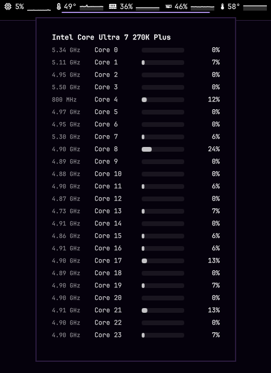

# downpour-sysmon

<p align="center">
  
</p>

A no-frills system monitor for [Omarchy](https://omarchy.org). One job: show what your machine is doing, then get out of the way.

**CPU · RAM · GPU** — usage and temps as quiet bar chips with optional sparklines. Click a chip for detail (per-core CPU stats). Right-click for settings. Alerts turn red when something’s hot. Polls every second. That’s it.

## Install

```sh
omarchy plugin add https://github.com/0xRainy/downpour-sysmon.git --enable
```

## Why it exists

Built together by **0xRainy** and **Grok** for Omarchy — a small, focused monitor that stays simple on purpose.
