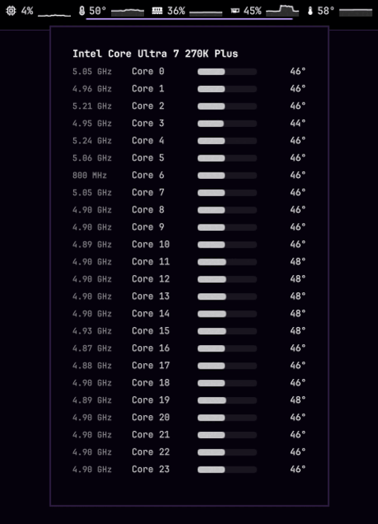

# downpour-sysmon

<p align="center">
  
</p>

A no-frills system monitor for [Omarchy](https://omarchy.org). One job: show what your machine is doing, then get out of the way.

**CPU · RAM · GPU** — usage and temps as quiet bar chips with optional sparklines. Click a chip for detail (per-core CPU stats). Right-click for settings. Alerts turn red when something’s hot. Polls every second. That’s it.

## Requirements

- **python3** — required (telemetry probe)
- **nvidia-smi** — optional; enables NVIDIA GPU usage/temp/freq chips when present

No installer, no services, no elevated privileges. The probe only reads local sysfs/`/proc` (and `nvidia-smi` if available).

## Install

```sh
omarchy plugin add https://github.com/0xRainy/downpour-sysmon.git --enable
```

## Usage

- **Left-click** a chip — detail popup
- **Right-click** — settings (visibility, alerts, graphs, frequencies)
- **Escape** — close the popup

## Configure

```sh
omarchy bar move downpour.sysmon --section right
```

## Remove

```sh
omarchy plugin remove downpour.sysmon
```

## Why it exists

Built together by **0xRainy** and **Grok** for Omarchy — a small, focused monitor that stays simple on purpose.
